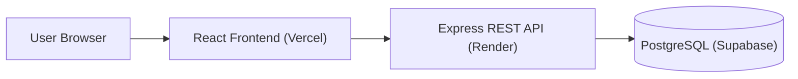

# Job Tracker
# Job Tracker Frontend

[](https://react.dev/)
[](https://vercel.com/)
[](https://developer.mozilla.org/en-US/docs/Web/JavaScript)

## Live Demo

🚀 **Try the app here:** [job-tracker-frontend-red.vercel.app](https://job-tracker-frontend-red.vercel.app)

## Overview

Job Tracker is a frontend React application for organizing job applications during a job search. It connects to a separate backend API for authentication and job data, then gives users a dashboard to manage the opportunities they are tracking.

With the app, users can:

- Register and log in with authenticated accounts.
- Access a protected dashboard after authentication.
- Add job applications with company, role, status, and applied date details.
- Update each application's status as it moves through the hiring pipeline.
- Remove applications that are no longer relevant.
- Review and filter applications by their current status when supported by the connected backend/API workflow.

## Architecture Overview



## Screenshots

> Screenshots coming soon.

| Login | Dashboard |
| --- | --- |
| `Add login screenshot here` | `Add dashboard screenshot here` |

## Tech Stack

- **React** — component-based UI and client-side state management.
- **React Router** — page routing for login, registration, and dashboard screens.
- **Axios** — API requests to the backend service.
- **Tailwind CSS** — utility-first styling.
- **Vite** — local development server and production build tooling.
- **Vercel** — frontend deployment.

## Local Setup

### Prerequisites

- Node.js 18 or newer
- npm
- A running instance of the Job Tracker backend API

### Installation

1. Clone the frontend repository:

   ```bash
   git clone <frontend-repo-url>
   cd job-tracker-frontend
   ```

2. Install dependencies:

   ```bash
   npm install
   ```

3. Create a local environment file:

   ```bash
   cp .env.example .env
   ```

4. Add the backend API URL:

   ```env
   VITE_API_BASE_URL=http://localhost:5000
   ```

5. Start the development server:

   ```bash
   npm run dev
   ```

6. Open the local Vite URL shown in your terminal, usually:

   ```text
   http://localhost:5173
   ```

## Environment Variables

Create a `.env` file in the root of the frontend repo with the following variable:

```env
VITE_API_BASE_URL=http://localhost:5000
```

Use your deployed backend URL instead of `http://localhost:5000` when connecting the Vercel deployment to production.

## Backend Repository

This repository contains the **frontend only**. The Node.js, Express.js, PostgreSQL, JWT, and GitHub Actions CI/CD backend lives in a separate repository:

- **Backend repo:** `<backend-repo-url-placeholder>`

## Available Scripts

```bash
npm run dev
```

Starts the Vite development server.

```bash
npm run build
```

Builds the app for production.

```bash
npm run preview
```

Previews the production build locally.

```bash
npm run lint
```

Runs ESLint checks.

## What I Learned

Building the frontend helped me practice:

- Managing React component state for forms, job data, and UI updates.
- Creating authentication flows that store a JWT on login and use it for protected API requests.
- Protecting dashboard access by redirecting unauthenticated users back to the login page.
- Integrating a React frontend with a separate REST API using Axios.
- Handling job status updates from the UI and syncing changes with backend data.
- Preparing and deploying a Vite React application on Vercel.
